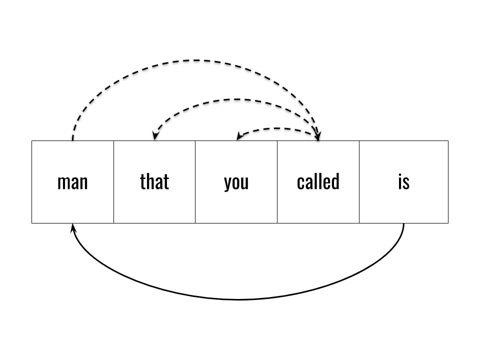
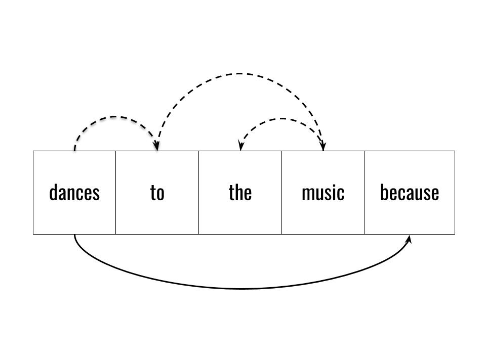
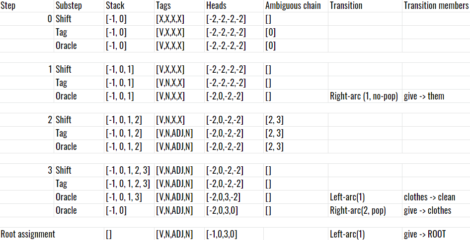
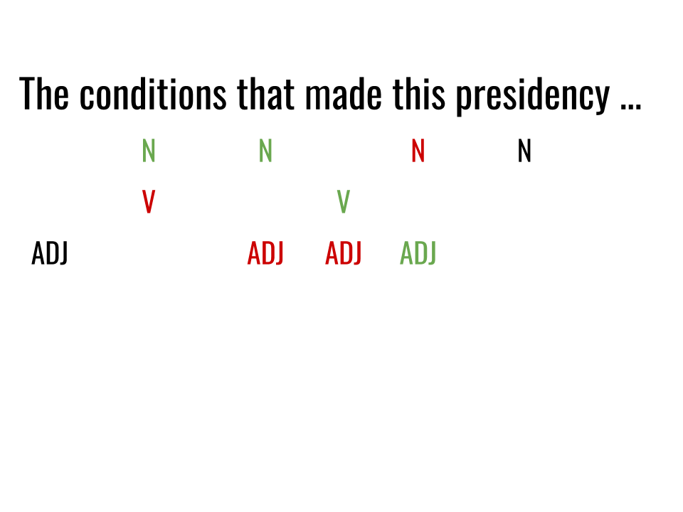
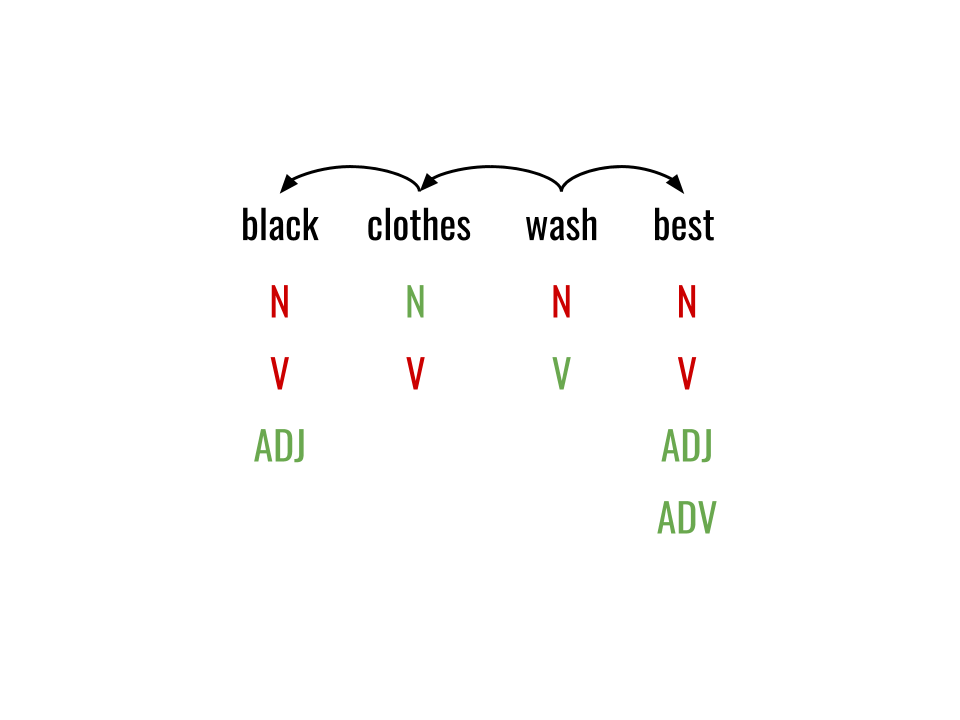

# A lightweight NLP pipeline based on handcrafted language rules

Research in natural language processing began decades ago and yet there are no models anywhere close to imitating an actual human's parse. Recent models are immense deep learning models with [prohibitively high costs and externalities](https://arxiv.org/pdf/1906.02243.pdf) that use massive amounts of energy to learn a language's grammatical rules. Rules that every speaker of a language knows intuitively.

Artisan is an attempt to create a framework for an NLP pipeline that researchers can extend and the industry can use. You can find the code at [its official repository](https://github.com/fpluis/artisan). It has been designed and built with the following considerations:
- 100% __client-side__ which opens many use-cases and guarantees __privacy__ and __safety__.
- Works fast enough for __real-time__ applications.
- Tolerates __ungrammatic and inconsistent texts__ such as tweets and arbitrary Internet user posts.
- Has __interpretable language rules__ that can be incrementally improved.
- Includes a __test suite__ to prove it works and show how it handles different texts.
- Is tailored to work with __English__ texts, although the same pipeline could be adapted to another language.

## Tasks in NLP

Think of NLP as a pipeline that progressively provides structure to unstructured data, like a secretary sorting an immense and very disorganized file archive.


Each step is more abstract than the last, and affects the rest of the pipeline. The three main steps in any NLP pipeline are:
1. __Word tokenization__: Characters are grouped into words.
2. __Sentence tokenization__: Words are grouped into sentences.
3. __Syntactic parsing__: The words in each sentence are given a role within the sentence with a PoS (part-of-speech) tag and they are linked to other words (dependency parsing).

All sentences have a structure that speakers automatically process, or __parse__ while reading and speaking. Subjects (John) carry out actions (plays), sometimes with additional details (the piano).

Parsing is the crucial step in the pipeline and we will focus most of the attention in this paper to it.

## Model History

Research on NLP during the last two decades [has focused on machine learning models](https://aclanthology.org/D13-1079.pdf). Over the _last decade_, this focus turned to deep learning models, [often based in word or character embeddings](https://arxiv.org/pdf/1708.02709.pdf). Finally, over the _last three years_, transfer learning has led research, following [BERT's success](https://www.aclweb.org/anthology/N19-1423.pdf).

While these models produce state-of-the-art results on most NLP tasks, they are so big and require so many computational resources that they can't run on a regular user's mobile phone or IoT device (As an example, see [BERT-Large](https://github.com/google-research/bert#pre-trained-models).

Their size heavily limits use-cases that need to process user's text, such as virtual assistants and writing assistant by forcing them to send user texts to a remote server, which has the following major implications:

1. __Security__: With full client-side processing, a malicious attacker can only gain access to the texts by compromising the device. By sending them to a remote server, the texts become vulnerable to attacks in transit i.e. man-in-the-middle, and also the server becomes a single point of failure vulnerable to data breaches and DDoS attacks. 
2. __Privacy__: Even if the server's maintainers promise to never access private user data, they may be compelled by law to do so. Additionally, if the infrastructure provider is a third party, that provider has root access to user data.
3. __Costs__: Removing the need to deploy a server with the NLP model reduces the cost of processing each individual text to $0. This makes use-cases with low or no profit from each interaction viable, for example virtual assistants that provide support or entertainment but that do not lead to a sale.
4. __User experience__: Sending a text over the Internet, passing it through a complex deep learning model and then sending it back can take several seconds. While acceptable for many applications, it can hurt the usability of real-time applications like a virtual assistant running on an IoT device.

Modeling the entire NLP pipeline as a deep learning model has additional consequences:
1. __Developer experience__: As a developer building an application on top of a deep learning model, if the model makes mistakes that cause your application to malfunction, it is frustratingly difficult to fix it: since the model is a black box, you can only change hyperparameters and retrain the model, but that doesn't guarantee fixing the issue nor breaking other cases.
2. __Evaluation__: The model's performance is measured using metrics like the F1 measure (harmonic mean between precision and recall). But these metrics do nothing to guarantee that the model will fulfill a specific application's requirements unless there are specific tests for those requirements. Deep learning models don't even provide an intuitive way to interpret improvement nor a specific threshold where the model becomes accurate enough for production: if a model goes from 91.8% to 93.1% accuracy, does it mean it's good enough now but it wasn't before?
3. __Dependence on a training set__: The quality of the labeled training dataset is a major factor in determining the model's accuracy. This is especially a problem for languages where the available datasets are small.
4. __Improvement boundaries__: Deep learning models can be tweaked until they reach their peak accuracy for a given dataset. Once they peak, they need to be replaced with a different model to improve accuracy. Since new models need to learn the same underlying rules, they don't build on the knowledge gained by previous models.

# The pipeline

## Word Tokenization

__Input__: A string of plain-text.
__Output__: An array of tokens (words annotated with lexical information).

Words are delimited by white space or punctuation in most languages, so word tokenization could be as straightforward to implement as:

```js
function tokenize (string) {
  return string.split(" ");
}
```


But this naive implementation fails in the real world, where texts are more complex. The function above covers most words in English, but there are many cases where it breaks:
- __Reductions__: Patterns like "gonna" or "kinda" compress two or more words, often changing them completely. Later steps in the pipeline, like the parser, will analyze the entire sentence incorrectly if reductions are not handled. Consequently, the tokenizer must identify two separate words in "kinda": "kind" with the lexical information of the word "kind", and "a" with the lexical information of the word "of".
- __Contractions__: Patterns like "can't", "he's", "let's" combine multiple words with an explicit apostrophe.
- __Symbols and punctuation__ like "'", "(", ")", "^", "$", "#". Some symbols represent words ("+" = "plus") and others, like punctuation, have a relevant syntactic function. If multiple symbols and/or punctuation characters appear together they must be separated to simplify the work of modules down the pipeline. Example: in the sentence "John can't play (he's busy)." the string after the last white space is "busy)." which contains three independent tokens: "busy", ")" and "."
- __Emojis__ like "🌉", "😀". Syntactically, emojis act as interjections.
- __Abstract entities__ such as URLs ("https://duckduckgo.com/") and phone numbers ("+23 999 481 23").

These cases are neither rare nor specific to the English language. The Chinese language does not have explicit word boundaries and each character can either be independent or bound to other characters next to it. In Spanish, for example, multiple words are often contracted. For example, in Spanish "_traemelo_" ("Bring it/him to me" in English) is formed by three separate tokens:
1. _trae_, imperative of _traer_, "bring".
2. _me_, accusative first person pronoun, "to me".
3. _lo_, nominative masculine/neutral third person pronoun, "him/it".

The naive tokenizer fails because it only considers the case where whitespaces are word boundaries. To cover other cases, regular expressions are necessary. These regular expressions both match specific types of tokens and add lexical information to them. Note that, while in theory word tokenization and retrieval of lexical information are separate steps, in practice separating them is inefficient.

The problem with running multiple regular expressions against the same text is that they can produce overlapping matches. To be useful, a word tokenizer must guarantee a perfect partition of text into tokens, such that:
1. Each token is matched by only one regular expression.
2. No character belongs to more than one token simultaneously.


Some lexical information can be inferred from the pattern that was used to match the token. For example, the regular expression for punctuation matches tokens whose PoS tag is always punctuation. For most words though, lexical information like its possible PoS tag depend on the specific word.

To retrieve this information we will need a dictionary with an entry for each word. The basic lexical information will be the word's lemma and possible PoS tag. Structuring the dictionary as a map of word => lexical properties, the dictionary is flexible in size depending on the applications it needs to support.

Given an input string _text_, the algorithm to transform it into a structured set of tokens can be defined as follows:
1. For each regular expression, find all matches in the text and create a token for each match.
2. Filter all overlapping tokens.
  1. If the tokens fully overlap, merge them.
  2. If the tokens partially overlap, pick the longest.
3. For each token, retrieve its normalized lexical information from the dictionary. If the word is not in the dictionary, attempt to deduce it from its morphology.
4. Split reductions and contractions into separate tokens.


Step 2 guarantees that tokens are always a partition over the input text. Step 3 can appear slow since it requires one dictionary access for each token in the text. However note that the dictionary is a JSON map that fits in memory of even modest devices as long as it is built properly.

## Sentencize

__Input__: An array of tokens (words annotated with lexical information).
__Output__: An array of sentences (arrays of tokens).

The only concern of this step is finding the tokens that are used to separate sentences, namely:
1. __Newline characters__ like "\n"
2. __Periods__ like "." or "..."
3. __Question marks__ like "?" or "❓"
4. __Exclamation marks__ like "!" or "❕"
5. __Semicolons__ like ";" or "⁏"

## Parse

__Input__: A sentence (array of tokens).
__Output__: A parsed sentence (array of tokens which are annotated with a PoS tag and their head in the dependency tree)

A syntax tree represents the structure in language. It uncovers the relationships between words and allows applications to find specific patterns and make intelligent searches on top of unstructured text. For example:
- Match __simple patterns__ such as verb + preposition regardless of the order of the components in the sentence. You can query a dependency tree for the pattern "lift > up" and match "He lifted up the trophy" as well as "He lifted his little daughter up"
- Match __complex patterns__ like passive sentences. This is possible because passive sentences follow detectable syntactic rules and it is useful because it allows an editing assistant to identify this type of sentences and automatically offer an active equivalent.

There are two components in dependency parsing:
- __Tagging__ adds a PoS tag to each word.
- __Head assignment__ adds a head (index of the parent word in the sentence) to each word.

The PoS tag describes the role of each word in the context of the sentence, and the head describes its position in the sentence's hierarchy. At the top of this structure lies the root, usually a verb, whose head is set to -1 as convention. The PoS tag that can be assigned to a token _must_ be one of the possible PoS tags assigned during tokenization.

Most words have a known and limited set of possible pos tags which is readily available at any online dictionary. This information will be part of the dictionary used during tokenization. As an example, the word "will" can either be a verb or a noun, but never an adjective, adverb, interjection nor punctuation. Words outside the dictionary will be assumed to be either verbs, nouns, adjectives or adverbs since prepositions and punctuation symbols are closed classes that change slowly and interjections are created often but they are also less frequent than content words.

There are highly useful lexical features for tagging and head assignment that we have taken from [Universal Dependencies](https://universaldependencies.org/u/feat/index.html), which is a framework to annotate language, and from [Interset](https://wiki.ufal.ms.mff.cuni.cz/user:zeman:interset). Note that some of these features are only useful to specific languages and completely absent in others, such as Gender, which is absent in English.

Tagging and parsing are often considered separate steps, which we believe is the wrong approach since it deprives the tagger of valuable information from the dependency parse of previous words. The algorithm we use is a modified version of the [arc-standard transition system](https://aclanthology.org/W04-0308.pdf) where the parser keeps a __list__ with the indices of the tokens whose head in the parse can change. Items are always inserted at the top of the list, like a stack, but can be removed from the middle of the list.

Parser transitions change the list and/or the heads, and have parameters. There are three possible transitions:
1. __Left Arc__: Assign the list element _childOffset_ positions away from the top as the child of the token at the top of the list. Also assign any headless elements between the two as the children of the token at the top.

2. __Right Arc__: Assign the list element _headOffset_ positions away from the top as the head of the token at the top of the list. Also assign any headless elements between the two as the children of the token _headOffset_ positions away from the top.

3. __Reduce__: Pop the top of the list.

Our algorithm can be described as follows:
1. For each token in the sentence:
  1. If it can only have one PoS tag, assign it as its PoS tag. Otherwise, take the longest possible chain of tokens with multiple possible tags and tag the chain.
  2. While the parsing oracle can find a valid transition, apply it to the list and call the oracle again.
2. Find the root among the headless tokens in the list.
3. For each headless token in the list: attempt to find its head in the list, assign it to the root otherwise.



What makes this approach different from other parsing algorithms is that it processes whole chunks at a time, as determined by the ambiguities present in a sentence.

Parsing and tagging simultaneously has the benefit of the _feedback effect_: the transition oracle uses the tags assigned by the tagger to decide the transition, and the tagger looks at the most recent parse to help decide a tag. The tagger can, for example, use the information that there is a noun conjunct right before the current ambiguous NOUN/ADJ token to disambiguate in favor of the noun.

### Tagging



The tagger has the task of finding the correct path of tags for a chain of tokens where each token has multiple possible tags. These chains are usually short because they end right before a word with a single possible PoS tag, like punctuation or stop words, which are very common.

An ambiguous token has between two and five possible tags out of the following: NOUN, VERB, ADJ, ADV, MARK or INTJ. For a chain of length L, this means between 2\*\*L and 5\*\*L combinations of tags. To prevent computing an exponentially unbounded number of chains in edge cases, we split the chain into chunks with a fixed maximum length. We call this length "pruning factor" and for this paper we use a pruning factor of __3__ because it provided good experimental results.

A 3-word chain can have between 16 and 625 paths possible paths. At this point, we could train a machine learning model to choose the best path given the chain's tokens. This machine learning model would routinely filter out a lot of nonsensical paths. For example, a token that can be either a common noun or a first person verb immediately after a personal nominative pronoun i.e. "play" in "I _play_" will never act as a noun. Any path where a noun follows a nominative pronoun should never be taken.

Machine learning models are capable of learning these rules automatically by training on a dataset, but that approach restricts the quality of the rules to be only as good as the dataset. If the model learns the wrong rules because it pays too much attention to noise in the training data it can be impossible to improve or fix the problem even if the developers add examples of that rule because the model simply focuses on the wrong information.

Instead, our approach uses hand-crafted rules. Since generating all the possible paths and then filtering them is an expensive process, we iteratively generate only the paths that comply with all the hand-crafted rules using the following algorithm:
- For each token in the chain, starting at the first.
  - For each tag for the token.
    - If the tag can be applied to the token, extend the possible subchains with this tag.

The tagging rules are the key to the tagger's success, as they can sometimes filter all paths but one and thus solve tagging for a specific chain, as in the image at the start of this section. A simple example of this kind of rule is:

"A verb/noun after a determiner is always a noun"

This is a simple, intuitive rule that automatically solves the ambiguity for "the case". Others are more complex but equally useful to disambiguate sentences. Take the following rule:

"A gerund after a finite verb is never a noun"

As examples, consider "He started _playing_" (could be followed by "tennis at 8 years old" or "against the other team") or "She is _staying_" (could be followed by "home today" or "at her friend's house").

Rules are created by identifying patterns in correct parses of sentences and adding the test cases that the rule covers. If we find a counterexample that breaks a rule, then the rule is either modified to adjust to the example or removed if it did not make sense in the first place.

#### Ambiguous chains

Language rules greatly reduce the number of ambiguous chains to consider, but sometimes they are not enough and the algorithm must still pick a path. This task can be implemented with any machine learning model, but since one of our requirements is to operate client-side and in real-time, there are limits to the size and speed of the model.

To minimize the model's performance impact, we use an averaged perceptron. One option would be scoring the whole path, but that would lead to sparse features as there are 5\*\*3 paths, each with N features. So instead we predict a tag for each token in the chain, using a pruning algorithm that is similar to the method we used to generate the possible paths:
- For each token in the chain, starting at the first.
  - If the paths that are still legal offer more than one tag for the token, predict one of those tags with the perceptron and discard every path where this token has a different tag.



The model only picks from tags that have not been removed by the deterministic rules, and only for words with more than one viable possible tag. When no trained model is loaded, the tagger picks the candidate with the highest relative frequency in the dictionary.

The disambiguation step is the bottleneck to the parser's performance since it requires a machine to consistently resolve ambiguities without understanding the meaning of the underlying words. To a human it is immediately apparent that if you are going to "study syntax" you are not referring to a _place_ called "study syntax" as it might be called "stone quarry", but to an _activity_. A machine is not able to make this distinction.

It does have access to other types of information to disambiguate. It can store information in the dictionary about the relative frequency of a word's PoS tags and use that information during this step to, say, disambiguate "study" in favor of a verb instead of a noun because its overall frequency as a verb is higher.

##### Features

Choosing good features is a difficult process. Most of ours combine the tags already chosen to the left with the morphology of the current and next words. Where a feature mentions a tag to the left, it uses an extended tag that keeps the distinctions the tagset drops: a modal, a participle, a past verb or a pronoun each get their own label. The features are:
1. Bias, and whether the word is capitalized.
2. The relative frequency of each candidate tag in the dictionary, bucketed into high, medium and low. Words whose frequencies were set by hand rather than measured are left out, because their numbers carry no information.
3. The word's shape: its tense, verb form, person, number, pronoun type, possessive and modal flags, and marker type. A word with none of these uses its set of candidate tags instead. Each shape feature is combined with the previous tag and with the previous two tags.
4. For frequent words, the word itself, the previous tag followed by the word, and, if the previous word is also frequent, the previous word followed by the word. Rare words get their last two, three and four letters instead, alone and after the previous tag.
5. The candidate tags of the next word, alone and after the previous tag. Every pairing of a shape feature of this word with a shape feature of the next word, alone and after the previous tag.
6. If the word often forms a phrasal verb with a specific preposition and that preposition is the next word, the relative frequency of each tag for that word + preposition pair. This is helpful for ambiguous nouns/verbs like "share" where the following preposition can heavily determine the tag. Examples: "share with (John, my friends, other people)" makes "share" likely a verb, whereas "share of (the loot, the company)" makes "share" likely a noun.

The tag frequencies (feature 2) and the preposition pairs (feature 6) are computed from unlabeled text, with the rules alone and no model loaded.

##### Training

We train on labels for positions which the model will have to disambiguate: a script runs the rules over a corpus and asks a large language model to settle only the positions the deterministic rules left open, choosing from the same candidate tags and following the same tagging guidelines. The perceptron then learns from those positions. The corpus is a sample of [model-written sentences](https://huggingface.co/datasets/redis/llm-paraphrases). Training keeps a set of sentences apart, scores the model on them after every epoch and keeps the best epoch, since accuracy on the training positions keeps rising long after accuracy on unseen ones has turned over.

Trained on 3,400 annotated sentences (5,749 examples) and scored on 600 held-out sentences from the same domain, the whole pipeline chose the right tag for 85.87% of the ambiguous words, against 64.51% with the fallback alone. On the hand-annotated reviews and tweets, which are out of domain, it scored 77.68% against 77.02%. These figures were measured when the model was trained; later rule changes have moved the out-of-domain score since. The perceptron on its own, scored only on the held-out ambiguous positions, was still improving with more training data: 997 examples gave 81.88%, 3,485 gave 84.42% and 5,749 gave 85.20%.

### The parsing oracle

The parsing oracle is Artisan's main achievement. It decides which transition, if any, to apply for each possible list state. Parsing rules are organized by PoS tag, so the oracle first of all checks the PoS tag of the word at the top of the list and uses it to decide which set of rules to apply. There are 6 set of rules in total that correspond to the tags NOUN, VERB, ADJ, ADV, MARK and PUNCT. Interjections (tagged INTJ) and unknown tokens (tagged X) are not considered part of the parse.

These oracles encode the language's syntactic rules explicitly as code. They can be as simple as:

ADJ rule: If the immediately preceding token in the list is an ADV, apply left-arc.

This rule models the immediate dependencies between adjectives and adverbs in, for example, "He is very handsome". But there are also highly complex grammatical structures that need to be handled for different tags. As an example, take the comma: a comma can introduce an appositive, can separate independent clauses, and it can also introduce noun or verb conjuncts, as is the case for this sentence.

The oracle must guarantee that there are no cycles in the dependency tree, otherwise further steps that recursively traverse the parse from the root will enter infinite loops. To fulfill this condition it is enough to check before left and right arcs that the child token is not already the ancestor of the head token.

The initial implementation of the oracle for any language is as simple as not performing any transition and then adding rules one by one, starting from simple yet common patterns like:

VERB rule: If the last word in the list is a nominative pronoun and there is subject-verb agreement, assign it as the subject.

This development process incrementally improves the tagging accuracy and documents each language rule. A complete implementation would be equivalent to mapping out the grammatical structure of a language.

## Pipeline extensions

Dependency parsing is the bedrock of any application that requires NLP, as it provides structure to unstructured data. Further steps can extend the information associated to each token relying on this structure.

# Miscellaneous and other concerns

## Parts of speech

In linguistics, like in other academic fields, there is no consensus on a fundamental issue: the universal set of PoS tags. In Western tradition, classifying parts of speech goes back to the Ancient Greeks, with the first tag set appearing in Dionysius Thrax's _The Art of Grammar_ (see [this thesis for more context on the history of parts-of-speech](https://theses.cz/id/p39bmz/DP_Leo_Hejl.pdf)). Since then, linguists have spent a great deal of time arguing about different systems from a philosophical perspective.

The advent of computers meant that parts of speech were no longer just a philosophical abstraction, but had a concrete purpose: processing natural language with a computer. Some of the most popular tag sets used in NLP research are the following:
- [Brown Corpus](http://korpus.uib.no/icame/manuals/BROWN/INDEX.HTM): Created in 1964, it has 87 different tags.
- [CLAWS](http://ucrel.lancs.ac.uk/claws/): Created in the 1980s, it has 132 different tags.
- [Penn Treebank](https://repository.upenn.edu/cgi/viewcontent.cgi?article=1246&context=cis_reports) (PTB): Created in 1993, it has 48 different tags.
- [Universal Dependencies](https://universaldependencies.org/u/pos/index.html) (UD): Created in 2014, it has 17 different tags.

Part of the reason why the number of tags varies so much from one specification to another is that some tag sets merge lexical features like verb form and grammatical function. Take personal pronouns for example:
- __CLAWS__ has 13 tags for personal pronouns that are as specific as single words i.e. 1st person singular subjective personal pronoun (PPIS1): "I".
- __Brown__ has 5 tags for personal pronouns to distinguish between possessive personal pronouns (PP$) such as "my" and objective personal pronouns (PPO) such as "me".
- __Penn Treebank__ has 1 tag for personal pronouns, PRP.
- __Universal Dependencies__ has only a tag for pronouns.

Universal dependencies is able to represent the same information as the other tag sets but instead of using exclusively the PoS tag, it uses [lexical attributes](https://universaldependencies.org/u/feat/index.html) such as the type of pronoun (PronType).

We have followed a similar approach but taken it one step further: some of UD's tags have overlapping grammatical functions, such as nouns and pronouns, so we have reduced the tag set down to 8 different tags:
- NOUN: Noun
- VERB: Verb
- ADJ: Adjective
- ADV: Adverb
- MARK: Marker (includes adpositions and conjunctions)
- PUNCT: Punctuation
- INTJ: Interjection
- X: Unknown

For a detailed overview of these tags and guidelines on how to apply them, we have prepared a [separate document](./parts-of-speech.md).

We originally implemented code using PTB's and later UD's tagset. The problem we kept running into was that a lot of the language rules had several pieces of code that checked if a word was a member of a class of tags, such as the common check to see if a dependent of a verb in the parse was its subject:

```js
function isSubject(childIndex, childTag, verbIndex) {
  return (
    childIndex < verbIndex &&
    ["NOUN", "NUM", "PRON", "PROPN"].includes(childTag)
  );
}
```

This pattern was a sign of a deeper problem: nouns, numbers, pronouns and proper nouns were all _nominals_, serving the same function in the parse, yet they were being categorized differently. By encoding as lexical features the properties that differentiate them, the parser is less redundant while also being nuanced enough to treat them differently under specific circumstances, such as not joining pronouns to other nouns when detecting compound nouns.

## Okay, but is this better than the state-of-the-art?

In short: we don't really know.

You might be interested in knowing whether this pipeline offers better performance than its alternatives. Unfortunately, comparing this pipeline to the state-of-the-art in NLP is not easy because there are fundamental differences in the way the performance for the two are measured: our pipeline has tests, most models have accuracy metrics over datasets.

These differences in evaluation are completely intentional and stem from three problems with evaluation for machine learning models in NLP.

### Ignoring the trade-offs

Recent NLP research shows a clear trend: deep learning models achieve better performances by increasing the number of parameters and the size of the training dataset. An increase of a few percentage points requires the addition of hundreds of millions of parameters. As an example, [the original BERT paper](https://aclanthology.org/N19-1423.pdf) compares performance of two BERT models, base and large, which vary in the number of hidden layers and 230,000,000 parameters. The average accuracy improvement across all the evaluated tasks for BERT large is 2.5% (Look at the paper's Table 1).

[A paper looking at NLP model training energy costs (section 4.1)](https://arxiv.org/pdf/1906.02243.pdf) points out that [researchers applied transformers to translation tasks](https://arxiv.org/pdf/1901.11117.pdf), increasing the state-of-the-art BLEU score on a single task from 29.7 to 29.8 at a the cost of at least $150,000 plus considerable CO2 emissions.

Requiring thousands or even hundreds of thousands of dollars to train a model poses a huge barrier of entry for both researchers and entrepeneurs. If the models require specialized hardware like GPUs or TPUs to run cost-efficiently, as they often do, the cost may be prohibitively high. For researchers it is often enough to know that a model pushes the state-of-the-art by a few percentage points. But an engineer working on a real application wants to know the answers to these questions:
1. How much does it cost in time and dollars to train and run it?
2. What do the DevOps look like: Does it need specialized hardware? Do I need a server or can it run on the client?
3. Who can maintain it and improve it? Do I need an expert in machine learning?

If an academic paper does not include this information, it is useless for an industry practitioner. A slight performance increase is not justified if it costs thousands of dollars, new infrastructure and highly specialized human resources.

### Metrics neglect variance in task difficulty

In PoS tagging research, a model's performance over a test set is measured using the F1 measure: the harmonic mean between the precision (percentage of true positives over the true positives plus false positives) and recall (percentage of true positives over the true positives plus false negatives). This method implicitly assumes that predicting tags is equally difficult across all words.

But that is not a realistic assumption. In fact, [words seem to be distributed by frequency following Zipf's law](https://www.ncbi.nlm.nih.gov/pmc/articles/PMC4176592/pdf/nihms579165.pdf), with function words such as "the" or "and" as the most common. Most function words have a single possible PoS tag, specially markers, pronouns and determiners. If a model predicts any other tag than the ones the word can reasonably have, there is a flaw with the model. On the other hand, if it always predicts these very common cases correctly, then the accuracy results are inflated because they are treating function words and words with multiple possible PoS tags as equally difficult to predict.

Take for example this sentence from Penn Treebank's tagging test set:

```
"speculators are calling for a degree of liquidity that is not there in the market"
```

This sentence has 15 words. [Penn Treebank's tagset](https://repository.upenn.edu/cgi/viewcontent.cgi?article=1246&context=cis_reports) has 42 tags. Theoretically, a model using PTB tags has 42^15 possible tag assignments for the whole sentence. But most of them are nonsensical: any assignment where the word "the" is not tagged as "DT" (determiner) is wrong.

This notion can be extended to other words in the sentence: the following words have a single possible tag: "are", "for", "a", "of", "is", "the". To tag these 6 words, there is no need to use a ML model. A dictionary with the features for just the 100 most common words would assign the tag for these 6 words with 100% accuracy.

So the only real tagging decisions are for "speculators", "calling", "degree", "liquidity", "not", "there" and "market". If the dictionary is extended with the possible tags for common nouns and verbs beyond the 100 most common, some of these words are also automatically solved: "speculators", "degree" and "liquidity" always behave as nouns.

This leaves us with "calling", "not", "there" and "market". We only need to tag 4 words out of the original 15. Or, put another way, even if we assigned wrong tags to these ambiguous words, we would still have an overall accuracy of 73.33%. Now assume we implemented a baseline model to solve ambiguities that returns a random tag from the word's possible pos tags. Further assume that the possible tags stored for these four words are:

- calling: VERB, ADJ, NOUN
- not: ADJ, ADV
- there: INTJ, ADV, NOUN
- market: VERB, NOUN

Then there are two words where the tagger has a 50% chance to tag correctly ("not", "market"), and two words where it has a 33.33% chance to tag correctly ("calling", "there"). The average probability that the tagger assigns a tag correctly across the sentence is 84.4%.

This is the baseline accuracy for this sentence, but the idea can be extended to a whole dataset, randomly assigning one of [NOUN, VERB, ADJ, ADV] for unknown words. The purpose of this example was to show that a model which has an accuracy of 90% for this sentence would only be 5.6% over the baseline. So when looking at results in a tagging paper, knowing that some model has an F1 measure of 95.11% is not enough to know how good the model is without knowing the baseline for the evaluation dataset.

In any case, _global_ tagging accuracy is a misleading metric. The accuracy for only the words that have more than one possible tag is more relevant. For these words, the random tagging model shown above is not that good. It would have an accuracy of 41.5% for the four ambiguous words. A tagging model that had 95% tagging accuracy for only these ambiguous words would now be 53.5% above the baseline.

A similar case can be made for dependency parsing. Results are reported using unlabeled attachment score (UAS) and labeled attachment score (LAS), which are the percentage of correctly predicted dependencies over the total number of predicted dependencies. However, some head assignments are inherently easier than others. Take as an example the sentence "the man is happy": the four dependencies are immediate given the correct tags:
- "the" must be the modifier of "man"
- "man" must be the subject of "is"
- "is" must be the root
- "happy" must be the object of "is"

In contrast, there are cases where a token can have multiple heads in the parse. This is a common problem with sentences that have preposition + object pairs and multiple candidate heads in the parse.

Example: A person would naturally interpret the prepositional object "in the counter" from the sentence "Put the keys in the counter" as modifying the verb "put" and not the noun "keys". However, in "We visited the house in the countryside", that same person will assign "in the countryside" as the modifier of "house" and not of "visited" because the person has the real-word knowledge that houses can _be_ in countrysides and keys can _be put_ in counters.

How well a parser handles these ambiguous cases is very relevant to judge its quality; whether it can parse correctly the sentence "the man is happy" is not relevant at all.

### Benchmark datasets are not representative

Evaluating a NLP model is difficult because the domain of language is immense, so there can never be a benchmark that includes _all_ possible sentences. Instead, models are evaluated using benchmarks which are presumed to be _representative_ of language, at least for a specific task. This is a critical condition for evaluation: if a model achieves a new state-of-the-art performance on a benchmark that is irrelevant, _its performance is also irrelevant_.

When judging the quality of a natural language benchmark for a specific task such as PoS tagging or dependency parsing, size is not enough to guarantee representativeness. To see how, consider that you can fill the dataset with sentences where most or all head assignments are as easy as the ones for the example sentence "the man is happy" using lexical variations of the words in them without changing the syntactic structure, such as "many people live free" or "some birds can fly very fast".

Instead, it is important to examine whether the benchmark is representative in at least the following dimensions:
1. __Syntax__: Do the sentences include instances of all the different syntactic structures?
2. __Authorship__: Are the authors of the texts varied enough to represent the majority of the speakers of that language and the idiosyncratic word choices or syntactical structures they use?
3. __Vocabulary__: Is the vocabulary used similar in frequency to a regular speaker's vocabulary or is it skewed toward specific fields or jargons?
4. __Context__: Does the benchmark include sentences from conversation transcripts and include interjections ("oh", "hey") and filler words ("uh", "er")? Are the texts predominantly formal or informal?
5. __Time__: Has enough years passed since the texts were collected that the language or vocabulary have changed significantly since then? How far away are the source domains from the domains that the benchmark is now evaluating?

We hold that the burden of proof is on the proponents and users of a dataset as the benchmark for a specific task. Having a shared metric to measure progress for a specific task in NLP can be appealing, but if that metric is not relevant it undermines the value of all the research that uses it.

## Dependency parsing vs. constituency parsing

](./images/constituency-dependency.png)

Constituency parsing is the standard, top-down approach often taught in schools. The parser needs to process the whole sentence to identify its component structures (verb phrases, noun phrases and so on). While this approach follows a long academic tradition and makes sense as an algorithm, it has little to do with how humans actually process sentences. [People parse words immediately as they read them](https://www.coli.uni-saarland.de/~masta/WS15/FrazierRayner1982.pdf), understanding each new chunk based on what was just read.

Dependency parsing is a bottoms-up approach to parsing that looks for the direct relations between words, assigning one "head" word to each word in a sentence. This parsing algorithm is much closer to how we usually parse text, and even allows for the possibility of parsing text incrementally, as it arrives from, say, a stream of audio.

## Applications

A NLP pipeline adds value wherever you can find users producing texts. With the explosive growth of social media, blogging sites and question answering sites in the last decade, NLP has proved its value as the tool to extract information from massive amounts of unstructured data. Another type of application is one where the user interface is partially replaced or extended with a virtual assistant that understands natural language. Amazon's Alexa is a fresh example from popular culture of such an interface.

These are some of the companies that use NLP as a core tool:
1. __Analytics__: B2B services like [fractal.ai](https://fractal.ai/aide/)'s insight extraction from unstructured customer data, [gong.io](https://www.gong.io/)'s insights to help sales people and customer service representatives or [signal ai](https://www.signal-ai.com/)'s information extraction from massive amounts of online texts.
2. __Virtual assistants__: Assistants that automate help desk ticket resolution like [moveworks](https://www.moveworks.com/).
3. __Healthcare automation__: Businesses like [notable health](https://www.notablehealth.com) provide automated healthcare interactions and information extraction from patient records for healthcare providers.
4. __Writing assistants__: Platforms like [Grammarly](https://www.grammarly.com/) help writers avoid grammatical mistakes. Our own writing assistant [Textoic](https://textoic.com) helps businesses and individuals write clearer, and was used to edit this document.

## Other languages

We have described and provided a pipeline that handles the backbone tasks of any NLP application. Although the implementation is in English, the entire pipeline can be adapted to other languages. The two main language-dependant parts of the pipeline are:
1. The __dictionary__ with the lexical information necessary for each task.
2. The __dependency parsing rules__ that encode that language's grammar.

The algorithms for tokenization and tagging/parsing can be adapted to new languages without changing their architecture, only their language-specific parts. Note that adding a new language is non-trivial and much harder than machine learning alternatives such as a transformer trained over a labeled dataset.

Developing an entire language model is time-consuming, and ready-made solutions like BERT can help you start developing quick. After all, if you are interested in using NLP, you want to build an application on top of a model, and not build the model itself.

But realize that this pipeline exists for a reason. Machine learning models have immense hidden costs: you will eventually encounter model mistakes you won't be able to fix. Extending the training set for your application's language and tuning machine learning models requires a lot of development time and experience without guaranteeing the final model will work for you.

The pipeline we propose might take some time to develop for a language other than English. But once it's working, the developer experience is much better than the ML alternatives and it can be incrementally improved.